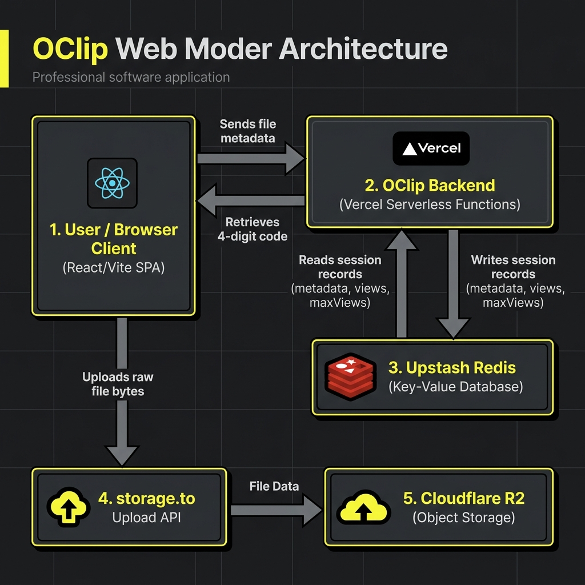

# ✦ RetroClipboard ✦

[](https://oclip.vercel.app)
[](https://upstash.com)
[](https://react.dev)
[](https://tailwindcss.com)

**RetroClipboard** is a beautifully designed, neo-brutalist styled online clipboard for temporary text and file sharing. Built with speed, security, and simplicity in mind, it lets you share snippets and files across devices using lightweight 4-digit codes without requiring any registration or accounts.

🌐 **Live Demo:** [https://oclip.vercel.app](https://oclip.vercel.app)

---

## 🏗️ System Architecture



The app utilizes a dual-tier storage strategy:
1. **Metadata Registry (Upstash Redis):** Store lightweight metadata records (types, view limits, expiration timestamps, filenames, and links) mapped to a unique 4-digit code.
2. **Binary Storage (storage.to / Cloudflare R2):** Upload raw file bytes directly from the client browser to Cloudflare R2 (brokered by storage.to) to bypass serverless payload limits.

---

## ✨ Features

- **Neo-Brutalist Aesthetic:** Vibrant contrast, bold borders, retro clock, and micro-interactions powered by Framer Motion.
- **Universal Paste & Upload:** Supports raw text clips and full file uploads (up to 25GB) via the modern drag-and-drop zone.
- **Instant QR Code Sharing:** Automatically generates high-quality QR codes for shared URLs with easy download actions.
- **Fast 4-Digit Retrievals:** Retrieve any text or file instantly by visiting the `/t/:code` or `/f/:code` URLs, or typing the code into the cache retrieval deck.
- **Burn-After-Read Security:** Toggle "Burn After Read" to destroy records from the database immediately after they are retrieved once.
- **Custom Expiration TTL:** Choose how long files and clips persist online (1 Hour, 1 Day, or 7 Days).
- **Responsive Previews:** Rich, inline previews for images, text, and PDF files.
- **Real-Time DB Status:** Inline system health monitor checking Upstash Redis connection in real-time.
- **Zero Tracking:** Fully serverless backend with database-level expirations. No tracking cookies, no registration.

---

## 🛠️ Tech Stack

- **Frontend:**
  - [React 19](https://react.dev/) + [Vite](https://vite.dev/)
  - [Tailwind CSS v4](https://tailwindcss.com/)
  - [Framer Motion](https://www.framer.com/motion/) (for UI transitions and micro-animations)
  - [react-dropzone](https://react-dropzone.js.org/) (for drag-and-drop file selectors)
  - [qrcode](https://www.npmjs.com/package/qrcode) (for client-side QR generation)
- **Backend (Serverless):**
  - [Vercel Serverless Functions](https://vercel.com/docs/functions) (JavaScript API routes under `/api`)
- **Database:**
  - [Upstash Redis](https://upstash.com/) (Serverless Redis for low-latency temporary key-value storage)
- **Storage:**
  - [storage.to](https://storage.to) (Cloudflare R2-backed storage supporting anonymous uploads up to 25GB)

---

## 📂 Project Structure

```text
online-clipboard/
├── api/                  # Vercel Serverless API Functions
│   ├── db.js             # Upstash Redis client initialization
│   ├── share.js          # POST - Saves clip with unique 4-digit code + TTL
│   ├── fetch.js          # POST - Fetches clip content using the code and tracks views
│   └── status.js         # GET - Database connectivity health check
├── public/               # Static assets
│   ├── oclip_architecture.png # Generated architecture diagram
│   └── vite.svg
├── src/                  # React Frontend Application
│   ├── assets/           # Static asset folders
│   ├── components/       # UI Components
│   │   └── retroui/      # Retro-styled UI buttons, widgets
│   ├── lib/              # Utility helpers
│   ├── App.jsx           # Main application interface and upload flows
│   ├── index.css         # Styling system containing neo-brutalist theme tokens
│   └── main.jsx          # Entrypoint for React 19
├── index.html            # HTML layout
├── vercel.json           # Vercel client-side routing rewrites
├── vite.config.ts        # Vite + Tailwind compiler configs
└── package.json          # Node dependencies & project scripts
```

---

## 🚀 Getting Started

Follow these instructions to run RetroClipboard on your local machine:

### 1. Clone the Repository
```bash
git clone https://github.com/atharvabaodhankar/online-clipboard.git
cd online-clipboard
```

### 2. Configure Environment Variables
Create a `.env` (or `.env.local`) file in the root directory and configure the following variables:

```env
# Frontend API URL configuration
VITE_API_URL=http://localhost:3000

# Upstash Redis credentials
UPSTASH_REDIS_REST_URL="https://your-upstash-redis-url.upstash.io"
UPSTASH_REDIS_REST_TOKEN="your-upstash-redis-token"
```

### 3. Install Dependencies
```bash
npm install
```

### 4. Run Locally
To run the frontend dev server along with Vercel serverless functions locally, install the [Vercel CLI](https://vercel.com/cli) and run:

```bash
# Start Vercel dev environment (spins up frontend and local api handler)
vercel dev
```

Alternatively, to run only the Vite frontend dev server (without serverless API features):
```bash
npm run dev
```

---

## 📡 API Reference

### 1. Save Clipboard
* **Endpoint:** `/api/share`
* **Method:** `POST`
* **Request Body (Text):**
  ```json
  {
    "type": "text",
    "content": "Text to be saved",
    "expiresAt": "1d", // Optional: "1h" | "1d" | "7d"
    "maxViews": 999    // Optional: set to 1 for Burn-After-Read
  }
  ```
* **Request Body (File):**
  ```json
  {
    "type": "file",
    "provider": "storage.to",
    "fileId": "FQxyz1234",
    "fileUrl": "https://storage.to/FQxyz1234",
    "rawUrl": "https://storage.to/r/FQxyz1234",
    "fileName": "resume.pdf",
    "size": "2.1MB",
    "expiresAt": "1d",
    "maxViews": 999
  }
  ```
* **Response:**
  ```json
  {
    "code": "4821"
  }
  ```

### 2. Fetch Clipboard
* **Endpoint:** `/api/fetch`
* **Method:** `POST`
* **Request Body:**
  ```json
  {
    "code": "4821"
  }
  ```
* **Response:**
  ```json
  {
    "content": "Text content if type is text",
    "record": {
      "code": "4821",
      "type": "file",
      "provider": "storage.to",
      "fileId": "FQxyz1234",
      "fileUrl": "https://storage.to/FQxyz1234",
      "rawUrl": "https://storage.to/r/FQxyz1234",
      "fileName": "resume.pdf",
      "size": "2.1MB",
      "createdAt": 123456789,
      "expiresAt": 123999999,
      "views": 1,
      "maxViews": 999
    }
  }
  ```

### 3. System Status
* **Endpoint:** `/api/status`
* **Method:** `GET`
* **Response:**
  ```json
  {
    "status": "ok",
    "database": "connected",
    "timestamp": "2026-06-07T05:22:43.000Z"
  }
  ```

---

## 🛡️ License
This project is licensed under the MIT License. Feel free to use, modify, and distribute it.
